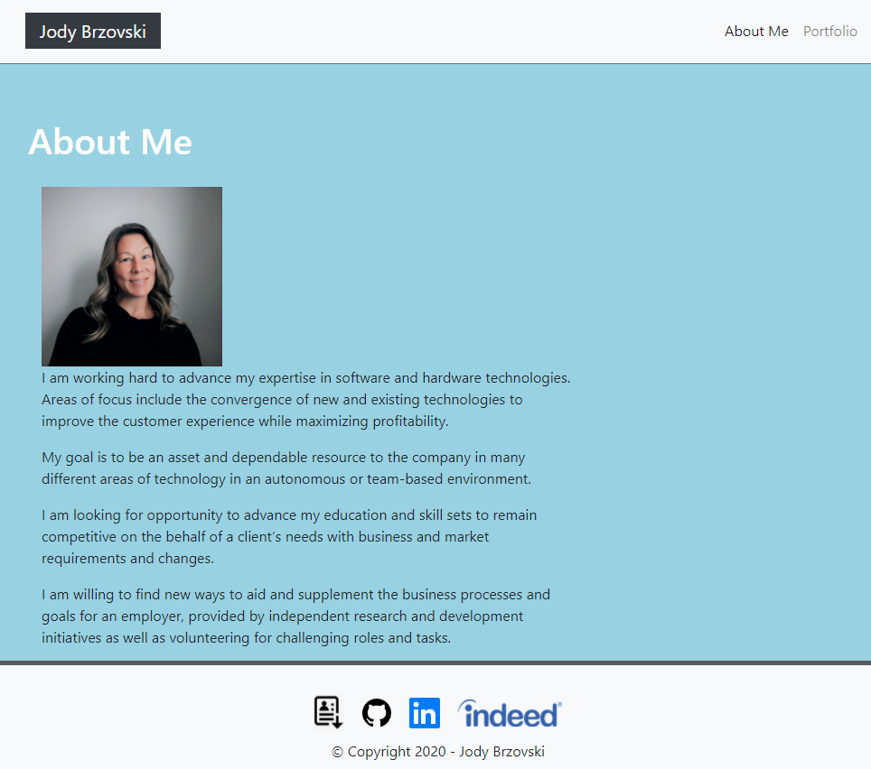
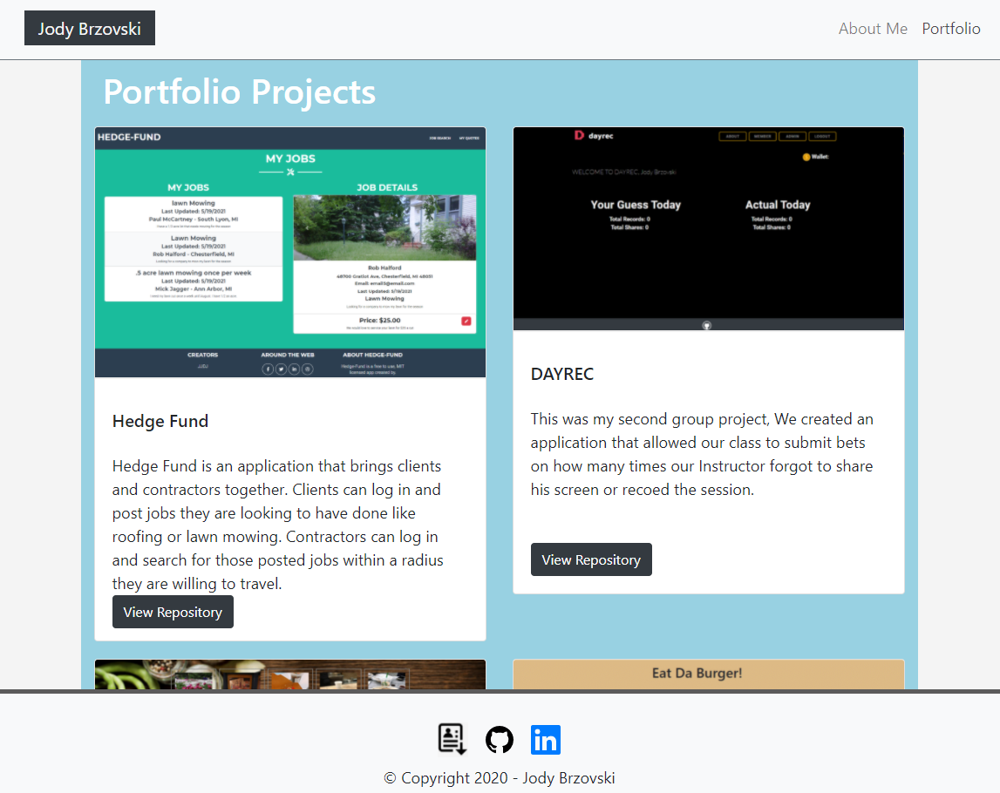

# react-portfolio
 Welcome to my online portfolio built using React.js.  This site showcases my skillset and sample projects as well as links to my resume and linkedIn page.  Please view the projects page and follow the links to my GitHub repo, checkout my README files for a full description of each project.

# Technology used
* React, useEffect, useState, HashRouter
* npm
* Bootstrap

# Usage
You can view the live deployed app on GitHub Pages here [Deployed Note Taker App ](https://jodybrzo.github.io/employeedirectory/)

---

### Home page lists out my skillset.

---

### project page lists a gallery of my sample projects with links to the live sites as well as the GitHub Repo.

---

# License
MIT License

Copyright (c) 2021 JodyBrzo

Permission is hereby granted, free of charge, to any person obtaining a copy 
of this software and associated documentation files (the "Software"), to deal
in the Software without restriction, including without limitation the rights
to use, copy, modify, merge, publish, distribute, sublicense, and/or sell
copies of the Software, and to permit persons to whom the Software is
furnished to do so, subject to the following conditions:

The above copyright notice and this permission notice shall be included in all
copies or substantial portions of the Software.

THE SOFTWARE IS PROVIDED "AS IS", WITHOUT WARRANTY OF ANY KIND, EXPRESS OR
IMPLIED, INCLUDING BUT NOT LIMITED TO THE WARRANTIES OF MERCHANTABILITY,
FITNESS FOR A PARTICULAR PURPOSE AND NONINFRINGEMENT. IN NO EVENT SHALL THE
AUTHORS OR COPYRIGHT HOLDERS BE LIABLE FOR ANY CLAIM, DAMAGES OR OTHER
LIABILITY, WHETHER IN AN ACTION OF CONTRACT, TORT OR OTHERWISE, ARISING FROM,
OUT OF OR IN CONNECTION WITH THE SOFTWARE OR THE USE OR OTHER DEALINGS IN THE
SOFTWARE.